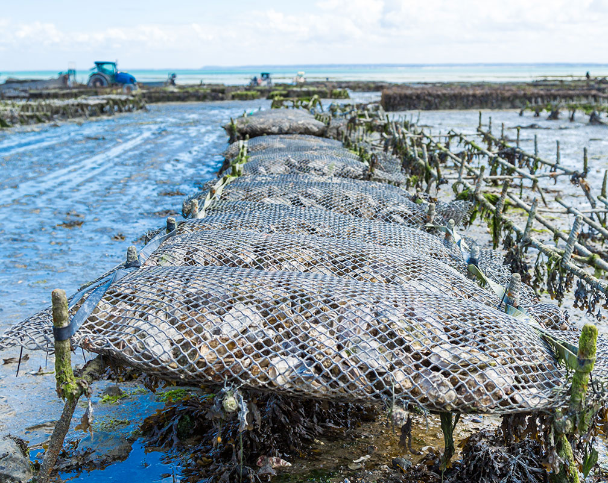

# Aquaculture Suitability

Analyzing coastal areas per West Coast Exclusive Economic Zones for aquaculture suitability for oysters and other species. Includes function development for analyzing and plotting suitability by total area and percentage area by EEZ.

**Author:** Anna Ramji \| [GitHub](https://github.com/a-ramji) \| [Website](https://a-ramji.github.io/)



Image credits: [alimentarium](https://www.alimentarium.org/en/fact-sheet/oyster)

## Overview

This project revolves around analyzing bathymetry, Sea Surface Temperature (SST), and Exclusive Economic Zone (EEZ) data to find suitable locations for Oyster aquaculture. I ultimately develop an aquaculture suitability funciton which, given input parameters of ideal depth and temperature ranges for a specified species, outputs two maps displaying the total area and percentage area suitable for aquaculture of that species in EEZs along the West Coast of the United States.

Workflow outline: - Reading in raster and shape files - Finding suitable oyster aquaculture areas - Mapping results: total area suitable and percentage of area suitable for aquaculture - Creating a function that reports and maps suitable areas for any aquaculture-appropriate species based on inputs of minimum temperature, maximum temperature, minimum depth, maximum depth, and species name

## Data

I use a few key datasets in this project:

### Sea Surface Temperature (SST) Data

In this project, I will use average annual sea surface temperature (SST) from the years 2008 to 2012 to characterize the average sea surface temperature within the region. The data I'll be working with was originally generated from [NOAA's 5km Daily Global Satellite Sea Surface Temperature Anomaly v3.1](https://coralreefwatch.noaa.gov/product/5km/index_5km_ssta.php).

### Bathymetry Data

To characterize the depth of the ocean I will use the [General Bathymetric Chart of the Oceans (GEBCO)](https://www.gebco.net/data_and_products/gridded_bathymetry_data/#area).[^readme-1]

[^readme-1]: GEBCO Compilation Group (2022) GEBCO_2022 Grid (<doi:10.5285/e0f0bb80-ab44-2739-e053-6c86abc0289c>).

### Exclusive Economic Zone (EEZ) Data

I will be designating maritime boundaries using Exclusive Economic Zones (EEZs) off of the west coast of US from [Marineregions.org](https://www.marineregions.org/eez.php).

### State boundaries

I use the [US Census' Cartographic Boundary](https://www.census.gov/geographies/mapping-files/time-series/geo/carto-boundary-file.html) files ["States"](https://www2.census.gov/geo/tiger/GENZ2018/shp/cb_2018_us_state_20m.zip) shapefile data at 20 meter resolution for my base map to establish geographical context.

## Repository Structure

``` bash

├── LICENSE
├── README.md # here
├── aquaculture-suitability-function.Rproj
├── data # too large for GitHub, see Data section
│   ├── average_annual_sst_2008.tif
│   ├── average_annual_sst_2009.tif
│   ├── average_annual_sst_2010.tif
│   ├── average_annual_sst_2011.tif
│   ├── average_annual_sst_2012.tif
│   ├── cb_2018_us_state_20m
│   │   ├── cb_2018_us_state_20m.cpg
│   │   ├── cb_2018_us_state_20m.dbf
│   │   ├── cb_2018_us_state_20m.prj
│   │   ├── cb_2018_us_state_20m.shp
│   │   ├── cb_2018_us_state_20m.shp.ea.iso.xml
│   │   ├── cb_2018_us_state_20m.shp.iso.xml
│   │   └── cb_2018_us_state_20m.shx
│   ├── depth.tif
│   ├── wc_regions_clean.dbf
│   ├── wc_regions_clean.prj
│   ├── wc_regions_clean.shp
│   └── wc_regions_clean.shx
├── docs # analysis documents
│   ├── aquaculture-suitability.html
│   ├── aquaculture-suitability.qmd
│   └── aquaculture-suitability_files
│       ├── figure-html # html rendered figures
│       │   ├── function-build-1.png
│       │   ├── pct-suitable-area-plot-1.png
│       │   ├── species-selection-1.png
│       │   ├── species-selection-2.png
│       │   ├── total-suitable-area-plot-1.png
│       │   └── unnamed-chunk-3-1.png
│       └── libs # css associated with quarto output
│           ├── bootstrap
│           │   ├── ~
│           ├── clipboard
│           │   └── ~
│           └── quarto-html
│               ├── ~
└── figs
    ├── oyster_pct_suitable_area_plot.png
    └── oyster_total_suitable_area_plot.png
```

## Acknowledgement

This repository and associated materials are based on an assignment for EDS223: Geospatial Analysis and Remote Sensing for the Masters of Environmental Data Science Program at UCSB, taught by Ruth Oliver.

### Sources

GEBCO Compilation Group (2022) GEBCO_2022 Grid (<doi:10.5285/e0f0bb80-ab44-2739-e053-6c86abc0289c>).

Gentry, R. R., Froehlich, H. E., Grimm, D., Kareiva, P., Parke, M., Rust, M., Gaines, S. D., & Halpern, B. S. (2017). Mapping the global potential for marine aquaculture. *Nature Ecology & Evolution*, 1, 1317-1324.

Hall, S. J., Delaporte, A., Phillips, M. J., Beveridge, M. & O'Keefe, M. (2011). Blue Frontiers: Managing the Environmental Costs of Aquaculture. The WorldFish Center, Penang, Malaysia.
